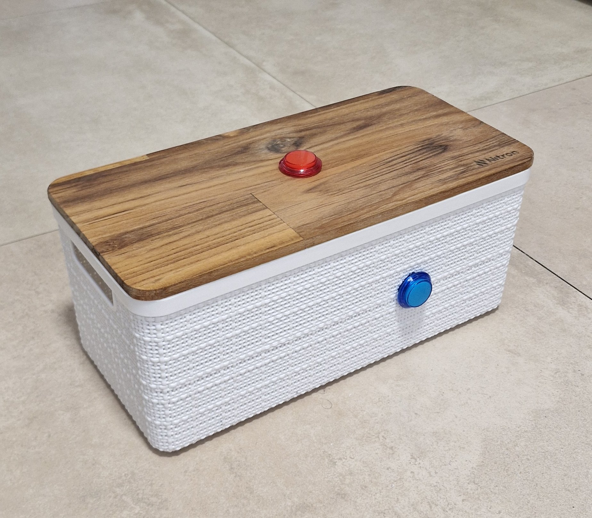

# Family Voice Message Box

## Índice

- [Cómo funciona](#cómo-funciona)
- [Por qué existe](#por-qué-existe)
- [En este repositorio](#en-este-repositorio)
- [Cómo empezar](#cómo-empezar)
  - [Setup](#setup)
  - [Botones GPIO (Raspberry Pi)](#botones-gpio-raspberry-pi)
  - [Configuración](#configuración)
  - [Dependencias del proyecto](#dependencias-del-proyecto)
  - [Ejecutar](#ejecutar)
  - [Arranque automático (Raspberry Pi)](#arranque-automático-raspberry-pi)
- [Estado](#estado)
- [Licencia](#licencia)

------



Una caja con dos botones. Eso es todo lo que necesita un niño para hablar con su familia.

Pulsa el botón superior para hablar y enviar un mensaje de voz al grupo de Telegram de la familia. Cuando llegan las respuestas, el botón junto al parlante se enciende para escucharlas. Sin pantallas, sin apps, sin depender de un teléfono.

Diseñada para acompañarlo donde esté: funciona con batería y no necesita estar enchufada.

------

## Cómo funciona

Al encenderla, la caja avisa al grupo familiar: *“Family Voice Box lista para comunicarse!”*. A partir de ahí:

1. **Pulsa y mantén** el botón de grabar (su LED se enciende) y habla.
2. **Suéltalo** para enviar el mensaje al grupo familiar.
3. Cuando alguien responde con una nota de voz, el LED de **oír** se enciende; púlsalo para escuchar.
4. El botón de oír **siempre suena**: con el LED apagado repite el último audio, las veces que quiera.

Simple para el niño. Cercano para todos.

------

## Por qué existe

Los más pequeños también quieren estar en contacto — pero un teléfono no es para ellos. Esta caja les da una forma propia de decir “hola”, contar algo o pedir un abrazo a distancia, sin pantallas.

------

## En este repositorio

El software y el diseño de la **Family Voice Message Box**: un proyecto open source pensado para armar en casa, adaptar a tu familia o tomar como punto de partida.

Si te interesa replicarla, colaborar o simplemente charlar sobre la idea, abre un issue o contáctame.

------

## Cómo empezar

### Setup

Necesitas **Node.js ≥ 24.7.0** (TypeScript nativo) y **ffmpeg** (para convertir las grabaciones a OGG/Opus antes de enviarlas a Telegram).

#### Raspberry Pi (Raspberry Pi OS)

```bash
sudo apt update
sudo apt install -y ffmpeg alsa-utils gpiod
```

- `ffmpeg` — conversión a OGG/Opus para Telegram  
- `alsa-utils` — `arecord` / `aplay`  
- `gpiod` — `gpiomon` / `gpioset` para botones y LEDs GPIO  

El usuario tiene que estar en el grupo `audio` (`sudo usermod -aG audio $USER` y reiniciar sesión). El jack de 3,5 mm **no graba**. Enchufa un micrófono o auriculares USB; `npm start` prioriza ese dispositivo (`arecord -l`) sobre las placas internas de la Pi (`bcm2835`, HDMI) y no usa el PCM `default` (falla con `pcm_asym` / capture slave is not defined). Para forzar uno: `ALSA_DEVICE=plughw:1,0` en `.env`.  

**No uses `apt install nodejs`.** En Raspberry Pi OS eso instala Node 20 (Debian 13 / Trixie) o 18 (Debian 12 / Bookworm). Node 20 no puede ejecutar archivos `.ts`: el stripping de tipos llegó en Node 22.6 (con flag) y es estable sin flag recién en 22.18+ / 24.

Instala Node 24 desde [NodeSource](https://github.com/nodesource/distributions):

```bash
curl -fsSL https://deb.nodesource.com/setup_24.x | sudo -E bash -
sudo apt install -y nodejs
node -v   # tiene que ser v24.x
```

Si ya tenías el `nodejs` de apt, este paso lo reemplaza.

#### Botones GPIO (Raspberry Pi)

Hay **dos botones LED** (momentáneos, active-low, pull-up interno):

| Función | Botón (BCM) | Pin físico | LED (BCM) | Pin físico |
|--------|-------------|------------|-----------|------------|
| **Grabar** (mantener pulsado) | 17 | 11 | 27 | 13 |
| **Oír** (última grabación / audio nuevo) | 22 | 15 | 23 | 16 |

- LED de **grabar**: se enciende mientras está pulsado (está grabando).
- LED de **oír**: se enciende **solo** cuando llega una nota de voz al grupo; se apaga al reproducirla. Pulsar el botón no lo enciende (con el LED apagado repite el último audio), así que sin mensajes nuevos queda apagado aunque el cableado esté bien. Para comprobarlo sin esperar a nadie, `npm start` enciende los dos LEDs 2 segundos al arrancar.
- GND: los ocho pines de masa (6, 9, 14, 20, 25, 30, 34, 39) son equivalentes, así que cada cable puede ir al que quede más cómodo. El diagrama usa uno distinto para cada masa — grabar en **6** y **9**, oír en **14** y **20** — para no meter dos cables en el mismo agujero. Quedan libres 25, 30, 34 y 39.

Cada botón tiene **4 lengüetas**: izquierda, derecha, inferior y posterior. En el plástico, posterior y derecha suelen decir **COM** y **NO** (el clic). Izquierda e inferior son el LED (si no enciende, intercambialas). ~330 Ω en el GPIO del LED si hace falta.

```text
  Vista desde atrás (lado de los cables; el pulsador queda del otro lado)

  Botón grabar (rojo, en la tapa)
             ┌────────────────┐
             │                │
   L. izq. ──┤    ┼── L. der.: pin 9   (GND)
    pin 13   │                │
   (LED +)   │                │=== L. posterior: pin 11   (GPIO 17)
             └────────┬───────┘
                      │
                  L. inferior: pin 6   (GND, LED −)

  Botón oír (azul, en el lateral junto al parlante)
             ┌────────────────┐
             │                │
   L. izq. ──┤    ┼── L. der.: pin 14   (GND)
    pin 16   │                │
   (LED +)   │                │=== L. posterior: pin 15   (GPIO 22)
             └────────┬───────┘
                      │
                  L. inferior: pin 20   (GND, LED −)

    pares  ->  2  4  6  8 10 12 14 16 18 20 22 24 26 28 30 32 34 36 38 40
               |  |  *  |  |  |  *  *  |  *  |  |  |  |  |  |  |  |  |  |
    impares->  1  3  5  7  9 11 13 15 17 19 21 23 25 27 29 31 33 35 37 39
               |  |  |  |  *  *  *  *  |  |  |  |  |  |  |  |  |  |  |  |
  ┌────────────+==+==+==+==+==+==+==+==+==+==+==+==+==+==+==+==+==+==+==+─┐
  │                                                                       │
  │                                                           [USB] [USB] ┼─
  │                                                           [USB] [USB] ┼─
  │                       Raspberry Pi 2 / 3                  [         ] │
  │                                                           [         ] ┼─
  └───┬─────────────────────────────────────────┬────────┬────────────────┘
       PWR                                    HDMI   jack 3,5 mm
```


En Pi 2 / 3 el chip GPIO suele ser `gpiochip0` (el default). En Pi 5 es `gpiochip4` (RP1): si `gpiomon` no ve las líneas, pon `GPIO_CHIP=gpiochip4` en `.env`.

Variables opcionales en `.env`: `GPIO_RECORD_BUTTON`, `GPIO_RECORD_LED`, `GPIO_PLAY_BUTTON`, `GPIO_PLAY_LED`, `GPIO_CHIP`. `GPIO_LINE` sigue valiendo como alias del botón de grabar.

#### macOS

Con [Homebrew](https://brew.sh):

```bash
brew install ffmpeg node
```

Para `npm run start:dev`, el terminal (o Cursor) necesita permiso de **Accesibilidad**:  
Ajustes del Sistema → Privacidad y seguridad → Accesibilidad.

#### Windows

Con [winget](https://learn.microsoft.com/windows/package-manager/winget/):

```powershell
winget install --id Gyan.FFmpeg -e
winget install --id OpenJS.NodeJS.LTS -e
```

O con [Chocolatey](https://chocolatey.org):

```powershell
choco install ffmpeg nodejs
```

Cierra y abre la terminal después de instalar para que `ffmpeg` y `node` estén en el `PATH`.  
Nota: hoy el modo de desarrollo interactivo (`start:dev`) está pensado para macOS; en Windows puedes usar las herramientas de setup (`find:group`, `ping:tg`).

### Configuración

#### Bot de Telegram

Crea un bot y ten listo el **grupo de Telegram de la familia** (puedes crear uno nuevo o usar uno existente si tienes acceso).

**Crear el bot**

1. Abre Telegram y habla con [@BotFather](https://t.me/BotFather).
2. Envía `/newbot` y sigue las instrucciones (nombre visible y username que termine en `bot`).
3. BotFather te da un **token** parecido a `123456:ABC-DEF...`. Ese valor va en `TELEGRAM_TOKEN`.
4. Desactiva la privacidad de grupo del bot (necesario para que vea las notas de voz del grupo familiar):
   - En BotFather: `/mybots` → elige tu bot → **Bot Settings** → **Group Privacy** → **Turn off**.
   - También puedes usar `/setprivacy` → elige el bot → **Disable**.

**Crear el grupo familiar** (si aún no tienes uno)

1. En Telegram, toca el ícono de lápiz / menú y elige **Nuevo grupo** (o *New Group*).
2. Elige al menos un contacto de la familia (Telegram pide al menos otra persona para crear el grupo) y ponle un nombre, por ejemplo “Familia”.
3. Entra al grupo → toca el nombre del grupo arriba → **Añadir miembros** / *Add members*.
4. Busca el username de tu bot (el que termina en `bot`) y agrégalo.

Si el grupo ya existe, solo agrega el bot con los pasos 3–4.

**Cómo obtener el `CHAT_ID` del grupo**

Es un número que identifica al grupo familiar (p. ej. `-1001234567890`). No lo inventes: el proyecto te lo muestra.

1. Ten `TELEGRAM_TOKEN` en tu `.env` (el token de BotFather).
2. Confirma que **Group Privacy** del bot está en **Turn off** (ver arriba).
3. Agrega el bot al grupo familiar (si aún no está).
4. Ejecuta el comando y, **mientras espera**, escribe en el grupo un mensaje al bot (por ejemplo `/start@FamilyVoiceMessageBot` o `@FamilyVoiceMessageBot hola`):

```bash
npm run find:group
```

5. Copia la línea `CHAT_ID=...` que imprima a tu `.env`.
6. Comprueba:

```bash
npm run ping:tg
```

Si llega `pong` al grupo, está bien. Si `CHAT_ID` es un chat privado con el bot, el comando falla y no envía el mensaje.

#### Archivo `.env`

Copia `.env.example` a `.env` y completa el token del bot y el `CHAT_ID` del grupo familiar:

```bash
cp .env.example .env
```

Ejemplo:

```env
TELEGRAM_TOKEN=123456:ABC-DEF...
CHAT_ID=-1001234567890
```

### Dependencias del proyecto

```bash
npm install
```

### Ejecutar

En ambos casos el proceso **queda corriendo**:

En la Raspberry Pi (botones GPIO + LEDs + `arecord` / `aplay`):

- Mantén pulsado **grabar** para hablar; suelta para enviar al grupo (el audio solo vive en `temp/` hasta enviarse).
- Cuando alguien del grupo envía una nota de voz, el LED de **oír** se enciende; púlsalo para escucharla. Con el LED ya apagado, ese mismo botón repite el último audio cuantas veces quieras.

```bash
npm start
```

Al arrancar enciende los dos LEDs a la vez durante 2 segundos para que veas si están bien cableados; el que no encienda es un problema de cables, no de software. Después imprime qué micrófono va a usar y con cuánta ganancia:

```text
Micrófono: USB PnP Sound Device (plughw:1,0)
  Ganancia de captura: 12 % — baja. Súbela con `alsamixer -c 1` (F4 = Capture) y guárdala con `sudo alsactl store`.
```

Cuando todo está listo avisa al grupo familiar con un mensaje de texto — **“Family Voice Box lista para comunicarse!”** — así se sabe que la caja está encendida sin tener que preguntar. Si ese envío falla, lo registra en consola pero la caja sigue funcionando igual.

**Si las grabaciones salen muy bajas** (da igual hablar cerca o lejos), casi siempre es la ganancia de captura, no el micrófono: muchos USB vienen de fábrica cerca de 0 %. Abre `alsamixer -c 1`, pulsa **F4** para ver las entradas, sube `Mic` / `Capture` con las flechas, activa el boost si aparece, y persístelo con `sudo alsactl store`. La HDMI no puede ser la culpable: `arecord -l` solo lista dispositivos de captura y las salidas de la Pi (jack y HDMI) no graban.

Si estás en la Pi y todavía no cableaste los botones, enchufa un **teclado USB** (no el de SSH): `npm start` usa evdev (`input-event`) con **espacio** (mantener) y **p** (oír). El usuario debe estar en el grupo `input`:

```bash
sudo usermod -aG input $USER
```

Cierra sesión o reinicia después. Si no hay dispositivo `*-event-kbd`, cae al teclado de la terminal SSH (sin key-up real). El servicio systemd no usa teclado: ahí solo cuentan los botones GPIO.

Sin pantalla ni teclado, en la Pi conviene el [arranque automático](#arranque-automático-raspberry-pi) en lugar de lanzar `npm start` a mano.

En la Mac, durante el desarrollo (espacio para grabar, `p` para oír audios del grupo). Los LEDs de grabar/oír se reflejan en consola (`●`/`○`) con la misma lógica que en la Pi:

```bash
npm run start:dev
```

**Calidad de audio en Mac (`start:dev`):** puede sonar mal — baja calidad, clicks y microcortes. No es un fallo de este proyecto ni del terminal: en macOS, la captura por `ffmpeg` + AVFoundation tiene ese problema conocido. El modo dev sirve para probar el flujo (botón, tiempos, Telegram), no para juzgar la calidad final del micrófono. La calidad real se evalúa en la Raspberry Pi (`npm start`).

Ctrl+C para salir.

Para descubrir el `CHAT_ID` del grupo familiar (mientras el comando espera, envía `/start@TuBot` en el grupo):

```bash
npm run find:group
```

Para enviar un mensaje `pong` al grupo familiar (usa `.env`):

```bash
npm run ping:tg
```

### Arranque automático (Raspberry Pi)

Para que la caja arranque sola al encender la Pi (sin teclado ni `npm start` manual):

1. Completa el [setup](#setup), `.env` y `npm install` en la Pi.
2. Instala y activa el servicio:

```bash
chmod +x scripts/install-boot-service.sh
sudo ./scripts/install-boot-service.sh
```

El `chmod` sobra si clonaste el repo con `git clone` (el bit de ejecución viaja en el commit), pero hace falta si lo bajaste como ZIP o lo copiaste desde Windows o un pendrive FAT. Ejecutarlo igual no molesta.

El script genera `/etc/systemd/system/family-voice-message-box.service` desde `systemd/family-voice-message-box.service`, lo habilita y lo arranca. Usa el usuario que invocó `sudo`, el `node` del `PATH` y el directorio del repo.

#### Comprobar que está corriendo

El servicio corre en segundo plano: **no abre ninguna terminal ni muestra nada en pantalla**. Las señales de que arrancó bien son los dos LEDs encendidos 2 segundos y el aviso en el grupo de Telegram; todo lo demás va al journal, no a una pantalla.

```bash
systemctl status family-voice-message-box
```

Mira la línea `Active:`:

| Dice | Significa |
|------|-----------|
| `active (running)` | Todo bien, la caja está escuchando los botones |
| `activating (auto-restart)` o `failed` | Está crasheando y systemd lo reintenta cada 5 s — mira los logs |
| `Unit ... could not be found` | El servicio nunca se instaló (¿corriste el script sin `sudo`? aborta si no eres root) |

Que arranque solo al encender la Pi es algo aparte; se confirma con `systemctl is-enabled family-voice-message-box`, que tiene que responder `enabled`.

Para ver qué hizo desde el último arranque, o seguirlo en vivo mientras pulsas los botones:

```bash
journalctl -u family-voice-message-box -b --no-pager
journalctl -u family-voice-message-box -f
```

**No ejecutes `npm start` mientras el servicio corre**: los dos procesos pelearían por las mismas líneas GPIO y `gpiomon` fallaría. Párala primero.

```bash
sudo systemctl stop family-voice-message-box
sudo systemctl restart family-voice-message-box   # después de un git pull
sudo systemctl disable --now family-voice-message-box
```

El usuario del servicio debe pertenecer a los grupos `audio` y `gpio` (el script lo intenta con `usermod`). Si acabas de agregarlos, reinicia la sesión o la Pi.

------

## Estado

Proyecto en etapa inicial.

------

## Licencia

[MIT](LICENSE)
