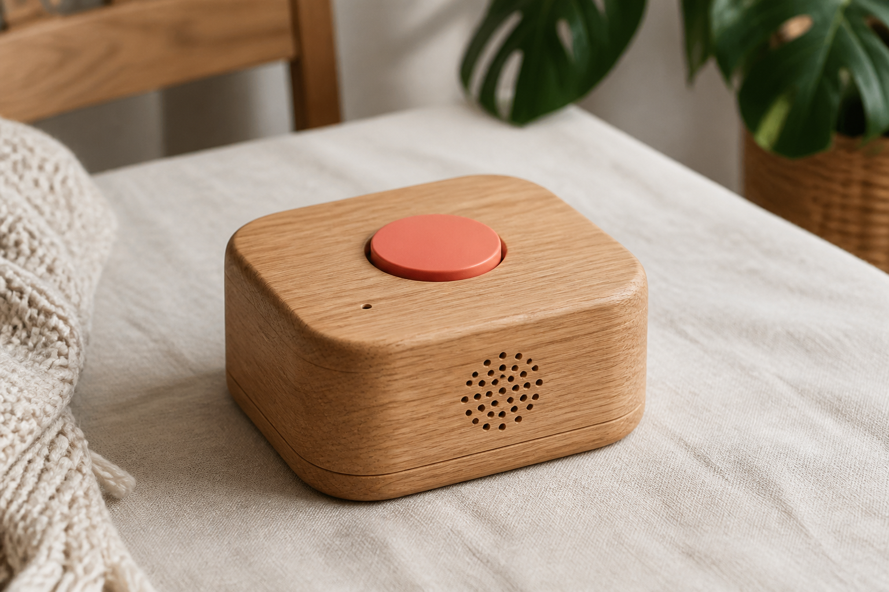

# Family Voice Message Box

## Índice

- [Cómo funciona](#cómo-funciona)
- [Por qué existe](#por-qué-existe)
- [En este repositorio](#en-este-repositorio)
- [Cómo empezar](#cómo-empezar)
  - [Setup](#setup)
  - [Botones GPIO (Raspberry Pi)](#botones-gpio-raspberry-pi)
  - [Configuración](#configuración)
  - [Dependencias del proyecto](#dependencias-del-proyecto)
  - [Ejecutar](#ejecutar)
- [Estado](#estado)
- [Licencia](#licencia)

------



*Mockup provisional — se reemplazará por una foto del proyecto real.*

Una caja con un botón. Eso es todo lo que necesita un niño para hablar con su familia.

Pulsa, habla y envía un mensaje de voz al grupo de Telegram de la familia. Cuando llegan las respuestas, la caja las reproduce. Sin pantallas, sin apps, sin depender de un teléfono.

Diseñada para acompañarlo donde esté: funciona con batería y no necesita estar enchufada.

------

## Cómo funciona

1. **Pulsa y mantén** el botón de grabar (su LED se enciende) y habla.
2. **Suéltalo** para enviar el mensaje al grupo familiar.
3. Cuando el LED del botón de **oír** esté encendido, púlsalo para escuchar el audio nuevo.

Simple para el niño. Cercano para todos.

------

## Por qué existe

Los más pequeños también quieren estar en contacto — pero un teléfono no es para ellos. Esta caja les da una forma propia de decir “hola”, contar algo o pedir un abrazo a distancia, sin pantallas.

------

## En este repositorio

El software y el diseño de la **Family Voice Message Box**: un proyecto open source pensado para armar en casa, adaptar a tu familia o tomar como punto de partida.

Si te interesa replicarla, colaborar o simplemente charlar sobre la idea, abre un issue o contáctame.

------

## Cómo empezar

### Setup

Necesitas **Node.js ≥ 24.7.0** (TypeScript nativo) y **ffmpeg** (para convertir las grabaciones a OGG/Opus antes de enviarlas a Telegram).

#### Raspberry Pi (Raspberry Pi OS)

```bash
sudo apt update
sudo apt install -y ffmpeg alsa-utils gpiod
```

- `ffmpeg` — conversión a OGG/Opus para Telegram  
- `alsa-utils` — `arecord` / `aplay`  
- `gpiod` — `gpiomon` / `gpioset` para botones y LEDs GPIO  

Instala Node 24.7+ (por ejemplo desde [NodeSource](https://github.com/nodesource/distributions) o el sitio oficial de Node).

#### Botones GPIO (Raspberry Pi)

Hay **dos botones LED** (momentáneos, active-low, pull-up interno en el switch):

| Función | Switch (BCM) | Pin físico | LED (BCM) | Pin físico |
|--------|--------------|------------|-----------|------------|
| **Grabar** (mantener pulsado) | 17 | 11 | 27 | 13 |
| **Oír** (última grabación / audio nuevo) | 22 | 15 | 23 | 16 |

- LED de **grabar**: se enciende mientras está pulsado (está grabando).
- LED de **oír**: se enciende cuando hay audio nuevo pendiente; se apaga al reproducirlo.
- GND compartido: p. ej. **pin 9**.


**Switch:** un lado al GPIO del botón, el otro a GND.  
**LED del botón:** GPIO del LED → LED (con resistencia ~330 Ω si el botón no la trae) → GND. Nivel alto = encendido.

Variables opcionales en `.env`: `GPIO_RECORD_BUTTON`, `GPIO_RECORD_LED`, `GPIO_PLAY_BUTTON`, `GPIO_PLAY_LED`, `GPIO_CHIP` (default `gpiochip0`). `GPIO_LINE` sigue valiendo como alias del botón de grabar.

#### macOS

Con [Homebrew](https://brew.sh):

```bash
brew install ffmpeg node
```

Para `npm run start:dev`, el terminal (o Cursor) necesita permiso de **Accesibilidad**:  
Ajustes del Sistema → Privacidad y seguridad → Accesibilidad.

#### Windows

Con [winget](https://learn.microsoft.com/windows/package-manager/winget/):

```powershell
winget install --id Gyan.FFmpeg -e
winget install --id OpenJS.NodeJS.LTS -e
```

O con [Chocolatey](https://chocolatey.org):

```powershell
choco install ffmpeg nodejs
```

Cierra y abre la terminal después de instalar para que `ffmpeg` y `node` estén en el `PATH`.  
Nota: hoy el modo de desarrollo interactivo (`start:dev`) está pensado para macOS; en Windows puedes usar las herramientas de setup y scripts como `send:last` cuando tengas grabaciones.

### Configuración

#### Bot de Telegram

Crea un bot y ten listo el **grupo de Telegram de la familia** (puedes crear uno nuevo o usar uno existente si tienes acceso).

**Crear el bot**

1. Abre Telegram y habla con [@BotFather](https://t.me/BotFather).
2. Envía `/newbot` y sigue las instrucciones (nombre visible y username que termine en `bot`).
3. BotFather te da un **token** parecido a `123456:ABC-DEF...`. Ese valor va en `TELEGRAM_TOKEN`.
4. Desactiva la privacidad de grupo del bot (necesario para que vea la actividad del grupo familiar):
   - En BotFather: `/mybots` → elige tu bot → **Bot Settings** → **Group Privacy** → **Turn off**.
   - También puedes usar `/setprivacy` → elige el bot → **Disable**.

**Crear el grupo familiar** (si aún no tienes uno)

1. En Telegram, toca el ícono de lápiz / menú y elige **Nuevo grupo** (o *New Group*).
2. Elige al menos un contacto de la familia (Telegram pide al menos otra persona para crear el grupo) y ponle un nombre, por ejemplo “Familia”.
3. Entra al grupo → toca el nombre del grupo arriba → **Añadir miembros** / *Add members*.
4. Busca el username de tu bot (el que termina en `bot`) y agrégalo.

Si el grupo ya existe, solo agrega el bot con los pasos 3–4.

**Cómo obtener el `CHAT_ID` del grupo**

Es un número que identifica al grupo familiar (p. ej. `-1001234567890`). No lo inventes: el proyecto te lo muestra.

1. Ten `TELEGRAM_TOKEN` en tu `.env` (el token de BotFather).
2. Confirma que **Group Privacy** del bot está en **Turn off** (ver arriba).
3. Agrega el bot al grupo familiar (si aún no está).
4. Ejecuta el comando y, **mientras espera**, escribe en el grupo un mensaje al bot (por ejemplo `/start@FamilyVoiceMessageBot` o `@FamilyVoiceMessageBot hola`):

```bash
npm run find:group
```

5. Copia la línea `CHAT_ID=...` que imprima a tu `.env`.
6. Comprueba:

```bash
npm run ping:tg
```

Si llega `pong` al grupo, está bien. Si `CHAT_ID` es un chat privado con el bot, el comando falla y no envía el mensaje.

#### Archivo `.env`

Copia `.env.example` a `.env` y completa el token del bot y el `CHAT_ID` del grupo familiar:

```bash
cp .env.example .env
```

Ejemplo:

```env
TELEGRAM_TOKEN=123456:ABC-DEF...
CHAT_ID=-1001234567890
```

### Dependencias del proyecto

```bash
npm install
```

### Ejecutar

En ambos casos el proceso **queda corriendo**:

En la Raspberry Pi (botones GPIO + LEDs + `arecord` / `aplay`):

- Mantén pulsado **grabar** para hablar; suelta para enviar.
- Cuando el LED de **oír** esté encendido, púlsalo para escuchar.

```bash
npm start
```

En la Mac, durante el desarrollo (espacio para grabar, `p` para oír la última):

```bash
npm run start:dev
```

**Calidad de audio en Mac (`start:dev`):** puede sonar mal — baja calidad, clicks y microcortes. No es un fallo de este proyecto ni del terminal: en macOS, la captura por `ffmpeg` + AVFoundation tiene ese problema conocido. El modo dev sirve para probar el flujo (botón, tiempos, archivos), no para juzgar la calidad final del micrófono. La calidad real se evalúa en la Raspberry Pi (`npm start`).

Ctrl+C para salir.

Para escuchar la última grabación:

```bash
npm run play:last
```

Para reenviar la última grabación al grupo de Telegram de la familia (usa `.env`):

```bash
npm run send:last
```

Para descubrir el `CHAT_ID` del grupo familiar (mientras el comando espera, envía `/start@TuBot` en el grupo):

```bash
npm run find:group
```

Para enviar un mensaje `pong` al grupo familiar (usa `.env`):

```bash
npm run ping:tg
```

Para vaciar la carpeta `recordings/`:

```bash
npm run clear:recordings
```

------

## Estado

Proyecto en etapa inicial.

------

## Licencia

[MIT](LICENSE)
